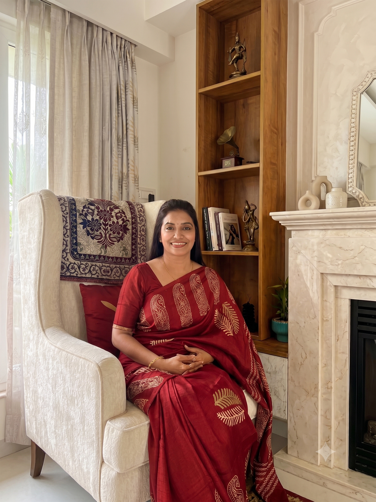

# Someone To Talk To — Nano Banana Image Prompts

Generate each image, save it with the filename shown, drop it into an `images/` folder
next to `index.html`, then replace the matching placeholder `<div class="ph">` block with
the `` tag already written in the HTML comment above it.

**Model recommendation:** Nano Banana Pro for all four (interior photography with soft
light renders noticeably better on Pro). No text rendering involved, so Flash is an
acceptable budget option.

**Shared style DNA (already baked into every prompt):** cream + sage green palette,
warm diffuse natural light, Kinfolk-magazine calm, matching the website's #F7F4EE /
#2E4A3B / #A8BFA5 theme.

---

## IMG-01 — Hero (arched frame, top of page)
**File:** `images/IMG-01-hero.jpg` · **Aspect ratio: 3:4**

```
Generate a warm editorial interior photograph. [Subject] A plush cream boucle armchair
with a sage green linen cushion, beside a small light-oak side table holding a matte
ceramic mug in soft moss-green glaze. [Context] A serene therapy-room corner: a tall
potted ficus plant to the right, sheer ivory linen curtains diffusing daylight, a small
framed botanical line print on a warm off-white wall. [Composition] Vertical 3:4 frame,
armchair as the hero slightly left of centre, generous breathing room above the chair
so the top of the image crops cleanly into an arch shape, soft negative space.
[Style] Shot on Hasselblad medium-format, 50mm prime at f/2.8, gentle shallow depth of
field, golden-hour window light from camera left, Kodak Portra 400 warm muted tones,
cream and sage colour palette, Kinfolk magazine editorial calm, high-end wellness brand
photography, empty scene with no people and no visible text.
```

---

## IMG-02 — About section (square card)
**File:** `images/IMG-02-about.jpg` · **Aspect ratio: 1:1**

```
Generate a quiet still-life photograph. [Subject] A handmade matte-white ceramic vase
holding fresh eucalyptus stems, beside a small lit soy candle in an amber glass jar.
[Context] Both resting on two stacked linen-bound books in muted oatmeal tones, set on
a pale wooden surface against a softly blurred warm cream wall. [Composition] Square
1:1 frame, objects grouped slightly right of centre at eye level, soft negative space
on the left. [Style] Macro-leaning 85mm lens at f/2, creamy shallow depth of field,
overcast diffuse window light, no harsh shadows, Kodak Portra 400 grade, desaturated
sage-and-cream palette, hygge wellness editorial still life, tack-sharp eucalyptus
leaves, clean scene with no text or labels.
```

---

## IMG-03 — FAQ section (tall, bottom-arched frame)
**File:** `images/IMG-03-faq.jpg` · **Aspect ratio: 3:4**

```
Generate a calm botanical interior photograph. [Subject] A lush green pothos plant in
a tall cream stoneware vase with subtle ribbed texture, paired with a small unlit white
pillar candle on a round light-wood tray. [Context] Placed on a pale linen runner near
a bright window, warm off-white wall behind, faint soft shadow of window panes falling
across the wall. [Composition] Vertical 3:4 frame, plant tall in the upper two-thirds,
tray anchoring the lower third, balanced centre composition that crops well with rounded
bottom corners. [Style] Fujifilm X100 warm colour science, 35mm equivalent, f/2.8,
morning side-light, airy high-key exposure, muted sage and ivory palette, minimalist
Scandinavian wellness aesthetic, photorealistic, no people, no text.
```

---

## IMG-04 — Contact section (landscape card)
**File:** `images/IMG-04-contact.jpg` · **Aspect ratio: 16:9**

```
Generate a serene wide interior photograph. [Subject] The inviting corner of a calm
consultation room: a sheer ivory linen curtain catching soft morning light, a low
rattan-and-oak bench with a folded sage green throw blanket, and a potted olive plant
in a terracotta-cream planter. [Context] Warm white plaster wall, light wooden floor,
a hint of a woven jute rug in the foreground. [Composition] Horizontal 16:9 frame,
curtain and window light on the left third, bench and plant on the right two-thirds,
shallow foreground leading the eye in. [Style] Shot on Hasselblad medium-format,
wide 35mm lens at f/4, golden diffuse backlighting through the curtain with gentle
lens bloom, Kodak Portra 400 warm grade, cream and sage palette, premium wellness
retreat photography, tranquil and empty, no people, no visible text.
```

---

## Swap instructions (quick reference)

In `index.html`, each placeholder looks like:

```html
<!-- IMG-01 · Replace with:  -->
<div class="ph"> ... </div>
```

Delete the `<div class="ph">...</div>` block and paste the `` tag from the comment.
The parent container already controls the crop, rounded/arched corners, and shadow —
no CSS changes needed.
